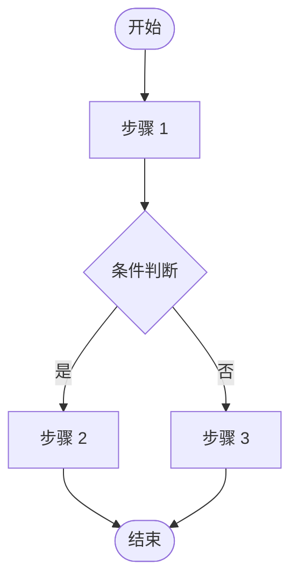
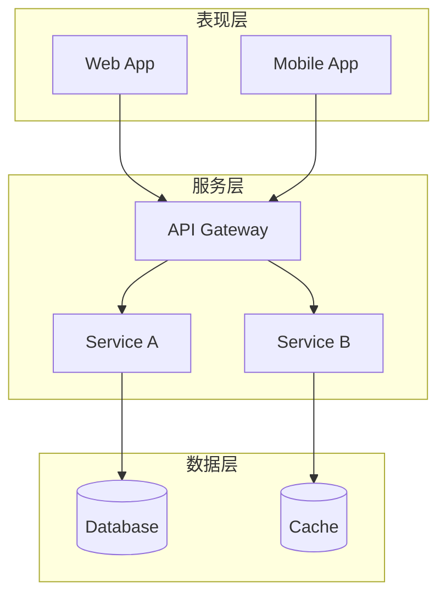
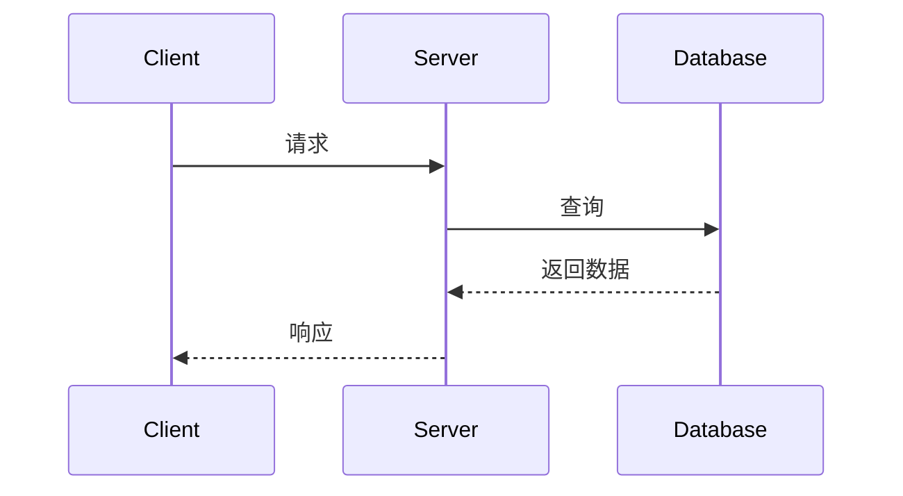
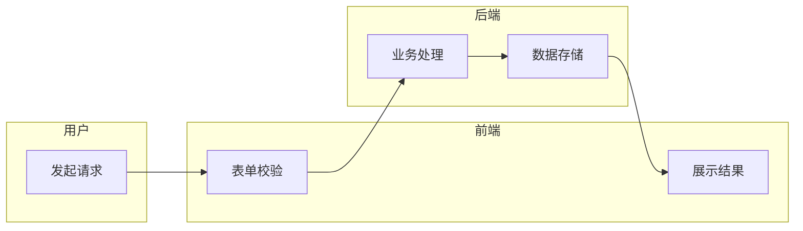

# 技术文档流程图生成规范

## 1. 生成流程

1. **识别图表类型**：根据业务需求匹配模板（见第 3 节）
2. **Mermaid 预览**：先输出 Mermaid 代码验证逻辑正确性
3. **XML 生成**：基于 [XML_REFERENCE.md](XML_REFERENCE.md) 的 XML 规范 + 样式字典，输出兼容 Confluence Draw.io 宏的 XML 文件

## 2. 文件原则

- **一图一文件**：一个业务图例对应一个 XML 文件
- **禁止自行拆分**：用户未明确要求时，不得将一个图例拆分为多个文件

## 3. 推荐模板

优先匹配模板确定布局骨架，再填充业务节点。XML 实现参考 [XML_REFERENCE.md](XML_REFERENCE.md)。

### 3.1 标准流程图

适用：业务流程、审批流、状态机、数据处理管线

**布局策略**：纵向 TD，椭圆开始/结束，矩形处理，菱形判断

**要点**：主轴垂直居中，同层节点 x 对齐；分支左右对称展开；菱形 width >= 120, height >= 80

### 3.2 系统架构图

适用：分层架构、微服务拓扑、模块依赖关系

**布局策略**：分层容器（swimlane）纵向堆叠，层内模块水平排列

**要点**：每层一个 swimlane（startSize=30）；层间间距 >= 80px；层内模块水平排列，间距 >= 40px；跨层连线 exitY=1 -> entryY=0

### 3.3 时序图

适用：接口调用链、系统交互、消息传递

**布局策略**：参与者水平排列于顶部，交互从上到下按时间推进

**要点**：参与者间距 >= 150px；生命线用虚线（dashed=1; dashPattern=8 8）；交互用自由连线（sourcePoint/targetPoint）；每组交互 y 递增 50-60px；返回箭头 dashed=1

### 3.4 泳道图

适用：跨角色/跨部门协作流程、职责划分

**布局策略**：swimlane 纵向堆叠，流程在泳道内从左到右推进

**要点**：每个角色一个 swimlane，纵向堆叠；泳道高度统一（100-150px），宽度覆盖完整流程；跨泳道连线用显式路径点；连线 parent="1"，不嵌套在泳道内

## 4. 布局规则

### 4.1 基础规则

- **节点不重叠**：任意节点矩形区域不相交
- **节点不超框**：节点完全在所属容器边框内
- **间距**：节点间距 >= 40px，容器/模块间距 >= 80px

### 4.2 树状布局

- 父节点在上，子节点在正下方水平排列
- 连线保持简单垂直/水平，避免斜向绕路
- 同层节点水平对齐

### 4.3 连线规则

- **不穿节点**：连线路径不穿过任何节点区域
- **路径最短**：拐弯最少原则
- **跨容器连线**：必须使用显式路径点 `<Array as="points">`，路径走画布边缘绕过节点

## 5. 设计原则

- **业务完整**：不省略业务逻辑节点，确保流程表达完整
- **视觉简约**：禁用突兀样式（如大黑点），清晰优先于紧凑
- **美观配色**：整体色调统一，不同模块使用不同色系区分，主节点可加粗或更深色调突出
- **层次分明**：入口/核心节点视觉突出，子节点相对弱化，模块框使用半透明背景区分区域

## 6. 自检清单

| 检查项 | 验证方法 |
|--------|----------|
| 节点无重叠 | 对比各节点 x/y/width/height |
| 节点不超框 | 节点坐标+尺寸 <= 容器坐标+尺寸 |
| 连线无碰撞 | 逐条列出路径坐标，验证不经过节点矩形 |
| 跨容器连线 | 确认使用了显式路径点，路径走边缘 |
| 路径无绕远 | 跨容器连线拐弯 <= 2 次 |
| mxCell 结构 | 所有 mxCell 是兄弟节点，无嵌套 |
| XML 语法 | 标签闭合、属性格式正确 |
| 配色协调 | 同类节点风格一致，可参考 XML_REFERENCE.md 配色参考 |

## 参考资料

- **XML 规范与样式字典**：[XML_REFERENCE.md](XML_REFERENCE.md) - XML 基础结构、节点/连线规范、容器模式、样式字典、配色参考
