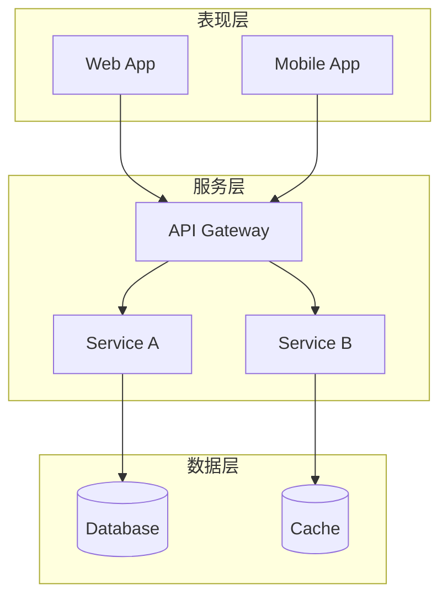
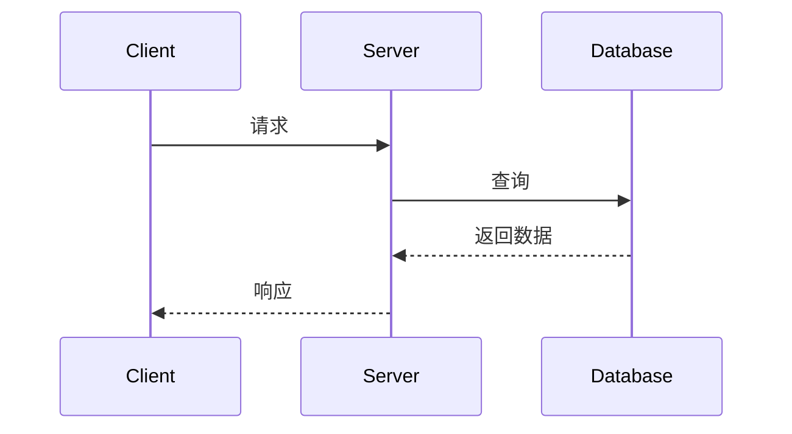
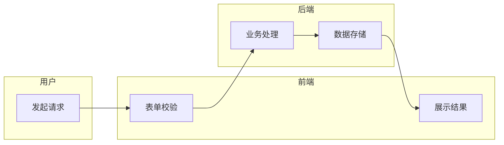

# 技术文档流程图生成规范

## 1. 生成流程

1. **识别图表类型**：根据业务需求匹配模板（见第 3 节）
2. **Mermaid 预览**：先输出 Mermaid 代码验证逻辑正确性
3. **XML 生成**：基于第 4 节 XML 规范 + 第 5 节样式字典，输出兼容 Confluence Draw.io 宏的 XML 文件

## 2. 文件原则

- **一图一文件**：一个业务图例对应一个 XML 文件
- **禁止自行拆分**：用户未明确要求时，不得将一个图例拆分为多个文件

## 3. 推荐模板

优先匹配模板确定布局骨架，再填充业务节点。XML 实现参考第 4-5 节。

### 3.1 标准流程图

适用：业务流程、审批流、状态机、数据处理管线

**布局策略**：纵向 TD，椭圆开始/结束，矩形处理，菱形判断


**要点**：主轴垂直居中，同层节点 x 对齐；分支左右对称展开；菱形 width >= 120, height >= 80

### 3.2 系统架构图

适用：分层架构、微服务拓扑、模块依赖关系

**布局策略**：分层容器（swimlane，见 4.3）纵向堆叠，层内模块水平排列



**要点**：每层一个 swimlane（startSize=30）；层间间距 >= 80px；层内模块水平排列，间距 >= 40px；跨层连线 exitY=1 -> entryY=0

### 3.3 时序图

适用：接口调用链、系统交互、消息传递

**布局策略**：参与者水平排列于顶部，交互从上到下按时间推进



**要点**：参与者间距 >= 150px；生命线用虚线（dashed=1; dashPattern=8 8）；交互用自由连线（sourcePoint/targetPoint，见 4.2）；每组交互 y 递增 50-60px；返回箭头 dashed=1

### 3.4 泳道图

适用：跨角色/跨部门协作流程、职责划分

**布局策略**：swimlane（见 4.3）纵向堆叠，流程在泳道内从左到右推进



**要点**：每个角色一个 swimlane，纵向堆叠；泳道高度统一（100-150px），宽度覆盖完整流程；跨泳道连线用显式路径点（见 4.2）；连线 parent="1"，不嵌套在泳道内

## 4. XML 规范

### 4.1 基础结构与约束

```xml
<mxfile>
  <diagram name="Page-1" id="page1">
    <mxGraphModel dx="800" dy="600" grid="1" gridSize="10" guides="1" tooltips="1" connect="1" arrows="1" fold="1" page="1" pageScale="1" pageWidth="850" pageHeight="600" math="0" shadow="0">
      <root>
        <mxCell id="0"/>
        <mxCell id="1" parent="0"/>
      </root>
    </mxGraphModel>
  </diagram>
</mxfile>
```

**mxGraphModel 属性**：

| 属性 | 说明 | 推荐值 |
|------|------|--------|
| dx, dy | 画布偏移 | 按复杂度自适应（推荐 800x600） |
| grid | 启用网格 | 1 |
| gridSize | 网格大小 | 10 |
| guides | 辅助线 | 1 |
| tooltips | 提示 | 1 |
| connect | 连接功能 | 1 |
| arrows | 箭头 | 1 |
| fold | 折叠功能 | 1 |
| page | 页面视图 | 1 |
| pageScale | 页面缩放 | 1 |
| pageWidth | 页面宽度 | 按复杂度自适应（推荐 850） |
| pageHeight | 页面高度 | 按复杂度自适应（推荐 600） |
| math | 数学公式 | 0 |
| shadow | 阴影 | 0 |

- **ID 规则**：从 "2" 开始递增，"0"/"1" 保留给 root
- **parent 规则**：顶层元素 parent="1"，子元素 parent 指向容器 ID
- **mxCell 不能嵌套**：所有 mxCell 必须是兄弟节点，edges 不嵌套在节点内
- 描述文本单行压缩，禁止 XML 注释

### 4.2 节点与连线

**节点（vertex）**：

```xml
<mxCell id="2" value="文本" style="rounded=1;whiteSpace=wrap;html=1;" vertex="1" parent="1">
  <mxGeometry x="100" y="100" width="120" height="60" as="geometry"/>
</mxCell>
```

必须属性：id（唯一）、value（文本）、style（见第 5 节）、vertex="1"、parent（容器 ID）

**连线（edge）**：

```xml
<mxCell id="3" style="edgeStyle=orthogonalEdgeStyle;rounded=0;html=1;" edge="1" parent="1" source="2" target="4">
  <mxGeometry relative="1" as="geometry"/>
</mxCell>
```

必须属性：edge="1"、source/target（端点 ID）；value 为可选标签

**自由连线**（无 source/target，如时序图箭头）：

```xml
<mxGeometry relative="1" as="geometry">
  <mxPoint x="140" y="120" as="sourcePoint"/>
  <mxPoint x="380" y="120" as="targetPoint"/>
</mxGeometry>
```

**显式路径点**（跨容器连线必须使用）：

```xml
<Array as="points">
  <mxPoint x="200" y="50"/>
</Array>
```

### 4.3 容器模式

架构图分层、泳道图角色均使用此模式。

```xml
<mxCell id="lane1" value="容器标题" style="swimlane;startSize=30;" vertex="1" parent="1">
  <mxGeometry x="40" y="40" width="500" height="200" as="geometry"/>
</mxCell>
<mxCell id="child1" value="子节点" style="rounded=1;whiteSpace=wrap;html=1;" vertex="1" parent="lane1">
  <mxGeometry x="20" y="40" width="120" height="40" as="geometry"/>
</mxCell>
```

- 子节点 parent 指向容器 ID，连线 parent="1"
- 可加 `container=1;collapsible=0;` 禁止折叠

**分组（Group）**：style="group" + connectable="0"，用于视觉聚合但不作为布局容器

### 4.4 表格与图层

**表格**：

```xml
<mxCell id="table1" style="shape=table;startSize=30;container=1;collapsible=1;childLayout=tableLayout;fixedRows=1;rowLines=0;fontStyle=1;align=center;" vertex="1" parent="1">
  <mxGeometry x="100" y="100" width="180" height="120" as="geometry"/>
</mxCell>
<mxCell id="row1" style="shape=tableRow;horizontal=0;startSize=0;swimlaneHead=0;swimlaneBody=0;fillColor=none;collapsible=0;dropTarget=0;points=[0,0.5,1,0.5];portConstraint=eastwest;" vertex="1" parent="table1">
  <mxGeometry y="30" width="180" height="30" as="geometry"/>
</mxCell>
```

**图层**：自定义图层 parent="0"，元素 parent 指向图层 ID

```xml
<mxCell id="layer2" value="图层2" style="locked=0;" parent="0"/>
<mxCell id="elem1" value="元素" style="rounded=1;whiteSpace=wrap;html=1;" vertex="1" parent="layer2">
  <mxGeometry x="100" y="100" width="120" height="60" as="geometry"/>
</mxCell>
```

## 5. 样式字典

### 5.1 形状样式

| 形状 | style 属性 | 适用场景 |
|------|-----------|----------|
| 矩形 | `rounded=1;whiteSpace=wrap;html=1;` | 流程节点 |
| 菱形 | `rhombus;whiteSpace=wrap;html=1;` | 判断/决策 |
| 椭圆 | `ellipse;whiteSpace=wrap;html=1;` | 开始/结束 |
| 圆柱 | `shape=cylinder3;whiteSpace=wrap;html=1;` | 数据库 |
| 三角形 | `shape=triangle;whiteSpace=wrap;html=1;` | 方向指示 |
| 六边形 | `shape=hexagon;whiteSpace=wrap;html=1;` | 准备/预处理 |
| 平行四边形 | `shape=parallelogram;whiteSpace=wrap;html=1;` | 输入/输出 |
| 文档 | `shape=document;whiteSpace=wrap;html=1;` | 文档/报告 |
| 云 | `shape=cloud;whiteSpace=wrap;html=1;` | 外部系统/云服务 |
| 人物 | `shape=actor;whiteSpace=wrap;html=1;` | 用户/角色 |
| 便签 | `shape=note;whiteSpace=wrap;html=1;` | 注释/说明 |
| 卡片 | `shape=card;whiteSpace=wrap;html=1;` | 卡片元素 |

### 5.2 连线样式

**基础样式**：`edgeStyle=orthogonalEdgeStyle;rounded=0;orthogonalLoop=1;jettySize=auto;html=1;strokeWidth=2;`

| 属性 | 可选值 | 说明 |
|------|--------|------|
| edgeStyle | orthogonalEdgeStyle, elbowEdgeStyle, entityRelationEdgeStyle | 路由方式 |
| endArrow | classic, open, oval, diamond, block, none | 终点箭头 |
| startArrow | classic, open, oval, diamond, block, none | 起点箭头 |
| curved | 0, 1 | 曲线连接 |
| dashed | 0, 1 | 虚线 |
| dashPattern | 如 "8 8" | 虚线图案 |

**锚点坐标**：

| 方向 | exitX/exitY | entryX/entryY |
|------|-------------|---------------|
| 上 | 0.5, 0 | 0.5, 0 |
| 下 | 0.5, 1 | 0.5, 1 |
| 左 | 0, 0.5 | 0, 0.5 |
| 右 | 1, 0.5 | 1, 0.5 |

锚点偏移：exitDx/exitDy/entryDx/entryDy（像素值）

### 5.3 通用属性

| 属性 | 说明 |
|------|------|
| fillColor / strokeColor | 填充色 / 边框色 |
| strokeWidth | 边框宽度 |
| fontColor / fontSize / fontStyle | 字体颜色 / 大小 / 0普通 1粗体 2斜体 |
| align / verticalAlign | 水平对齐 / 垂直对齐 |
| opacity | 0-100 |

### 5.4 配色参考

以下为可选参考，非强制，可根据图表内容自行调配：

| 用途 | fillColor | strokeColor |
|------|-----------|-------------|
| 开始/成功 | #d5e8d4 | #82b366 |
| 处理/步骤 | #dae8fc | #6c8ebf |
| 判断/决策 | #fff2cc | #d6b656 |
| 错误/警告 | #f8cecc | #b85450 |
| 外部系统 | #e1d5e7 | #9673a6 |
| 数据/存储 | #f5f5f5 | #666666 |

## 6. 布局规则

### 6.1 基础规则

- **节点不重叠**：任意节点矩形区域不相交
- **节点不超框**：节点完全在所属容器边框内
- **间距**：节点间距 >= 40px，容器/模块间距 >= 80px

### 6.2 树状布局

- 父节点在上，子节点在正下方水平排列
- 连线保持简单垂直/水平，避免斜向绕路
- 同层节点水平对齐

### 6.3 连线规则

- **不穿节点**：连线路径不穿过任何节点区域
- **路径最短**：拐弯最少原则
- **跨容器连线**：必须使用显式路径点 `<Array as="points">`，路径走画布边缘绕过节点

## 7. 设计原则

- **业务完整**：不省略业务逻辑节点，确保流程表达完整
- **视觉简约**：禁用突兀样式（如大黑点），清晰优先于紧凑
- **美观配色**：整体色调统一，不同模块使用不同色系区分，主节点可加粗或更深色调突出
- **层次分明**：入口/核心节点视觉突出，子节点相对弱化，模块框使用半透明背景区分区域

## 8. 自检清单

| 检查项 | 验证方法 |
|--------|----------|
| 节点无重叠 | 对比各节点 x/y/width/height |
| 节点不超框 | 节点坐标+尺寸 <= 容器坐标+尺寸 |
| 连线无碰撞 | 逐条列出路径坐标，验证不经过节点矩形 |
| 跨容器连线 | 确认使用了显式路径点，路径走边缘 |
| 路径无绕远 | 跨容器连线拐弯 <= 2 次 |
| mxCell 结构 | 所有 mxCell 是兄弟节点，无嵌套 |
| XML 语法 | 标签闭合、属性格式正确 |
| 配色协调 | 同类节点风格一致，可参考 5.4 |
