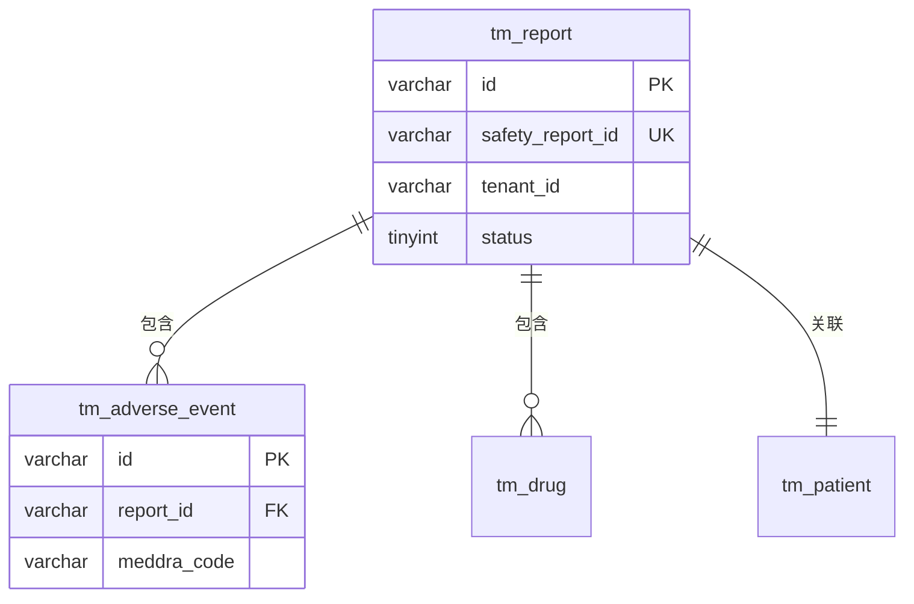

# 表结构提取与规范校验

## 触发条件

当用户提及以下关键词时触发：
- "表结构"
- "DDL"
- "数据模型清单"
- "字段清单"
- "表设计"

## 输入方式

支持以下三种输入，可组合使用：

### 1. DDL 语句

用户直接提供 `CREATE TABLE` 语句。

### 2. Entity 类代码

用户提供 Java Entity / DTO 类代码，从注解和字段定义中提取表结构。

### 3. 表名（通过 MCP）

使用 `describe_table` 工具从数据库直接获取：

```
对每个表名调用 describe_table
```

## 输出格式

对每张表按以下结构输出：

### 表级信息

```markdown
## {表名}

**用途说明**：{一句话描述该表的业务用途}

**存储引擎**：InnoDB | **字符集**：utf8mb4
```

### 字段明细表

```markdown
### 字段明细

| # | 字段名 | 类型 | 长度/精度 | 必填 | 默认值 | 说明 |
|---|--------|------|-----------|------|--------|------|
| 1 | id | VARCHAR | 36 | 是 | - | 主键ID (UUID) |
| 2 | tenant_id | VARCHAR | 36 | 是 | - | 租户ID |
| ... | | | | | | |
```

### 索引清单

```markdown
### 索引清单

| 索引名 | 类型 | 字段 | 说明 |
|--------|------|------|------|
| PRIMARY | 主键 | id | 主键索引 |
| uk_safety_report_id | 唯一 | safety_report_id | 业务主键 |
| idx_tenant_project | 普通 | tenant_id, project_id | 租户+项目查询 |
```

### 外键/关联关系

```markdown
### 关联关系

| 字段 | 关联表 | 关联字段 | 关系类型 | 说明 |
|------|--------|----------|----------|------|
| patient_id | tm_patient | id | 多对一 | 关联患者 |
```

## 规范校验

对照 [database-design-standards.md](../tech-design-review/standards/database-design-standards.md) 执行以下校验，在输出末尾附上校验结果：

### 校验项

| # | 校验规则 | 说明 |
|---|----------|------|
| 1 | 表名全小写 + 下划线分隔 | 不允许大写字母或驼峰 |
| 2 | 表名使用单数形式 | `tm_report` 而非 `tm_reports` |
| 3 | 表名包含业务模块前缀 | 如 `tm_` |
| 4 | 字段名全小写 + 下划线分隔 | 不允许驼峰 |
| 5 | 布尔字段使用 `is_` 前缀 | 如 `is_deleted` |
| 6 | 必备字段完整 | id, tenant_id, project_id, create_time, update_time, create_by, update_by, is_deleted |
| 7 | 主键类型正确 | UUID: VARCHAR(36) 或 BIGINT |
| 8 | 字段有 COMMENT 注释 | 每个字段都应有注释 |
| 9 | 索引命名规范 | pk_/uk_/idx_ 前缀 |
| 10 | 单表索引不超过 5 个 | 避免过多索引 |

### 校验结果格式

```markdown
### 规范校验结果

| 状态 | 校验项 | 说明 |
|------|--------|------|
| ✅ | 表名规范 | 符合小写下划线规则 |
| ⚠️ | 缺少必备字段 | 缺少 update_by 字段 |
| ❌ | 字段命名 | patientId 应改为 patient_id |
```

## 多表支持

当输入包含 2 张及以上表时，在所有表结构输出之后，额外生成 **Mermaid ER 图**：

```markdown
### 实体关系图


```

## 变更对比

当用户提供新旧两版 DDL 时，执行差异对比：

### 对比维度

1. **新增字段** — 列出新增的字段及定义
2. **删除字段** — 列出被移除的字段（标记风险）
3. **字段修改** — 类型变更、长度变更、约束变更
4. **索引变更** — 新增/删除/修改索引
5. **表级变更** — 表名、注释、引擎等

### 输出格式

```markdown
### 变更对比：{表名}

| 变更类型 | 对象 | 旧定义 | 新定义 | 风险等级 |
|----------|------|--------|--------|----------|
| 新增字段 | source_type | - | VARCHAR(50) NOT NULL | 低 |
| 修改字段 | remark | VARCHAR(200) | VARCHAR(500) | 低 |
| 删除字段 | old_field | VARCHAR(100) | - | 高 |
| 新增索引 | idx_source_type | - | (source_type) | 低 |

### 建议 ALTER 语句

```sql
-- 新增字段
ALTER TABLE tm_report ADD COLUMN source_type VARCHAR(50) NOT NULL COMMENT '来源类型' AFTER status;

-- 修改字段
ALTER TABLE tm_report MODIFY COLUMN remark VARCHAR(500) COMMENT '备注';

-- 删除字段（请确认数据已迁移）
-- ALTER TABLE tm_report DROP COLUMN old_field;

-- 新增索引
ALTER TABLE tm_report ADD INDEX idx_source_type (source_type);
```
```

> **注意**：删除字段的 ALTER 语句默认注释掉，需人工确认后执行。

## 错误处理

| 错误场景 | 处理方式 |
|----------|----------|
| DDL 语法不完整 | 提示用户补充完整的 CREATE TABLE 语句 |
| describe_table 失败 | 提示检查表名是否正确，数据库连接是否配置 |
| Entity 类缺少注解 | 尝试从字段名和类型推断，标注推断项 |
| 无法识别关联关系 | 基于外键字段命名（_id 后缀）推断，标注为推断 |
